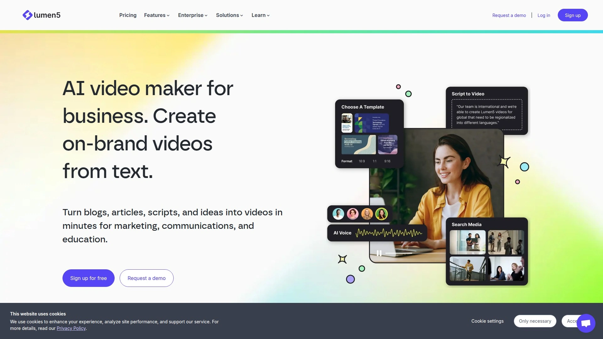

# Top 18 AI Video Ad Generator Platforms Ranked in 2025 (Latest Compilation)

Picture yourself sitting in front of your laptop with a cup of coffee. You've got a product to sell, and you need video ads—lots of them, across multiple platforms, each one fresh and engaging. Maybe you tried hiring creators before. Maybe you spent hours learning editing software. Either way, it took too long and cost too much. So you went looking.

What if creating high-quality video ads was as simple as typing a few lines? What if you could test twenty different versions of an ad in the time it once took to produce one? For e-commerce brands, marketers, and content creators navigating 2025, AI video ad generators aren't just time-savers—they're business accelerators. From generating UGC-style testimonials to transforming product URLs into scroll-stopping content, these platforms handle the heavy lifting while you focus on strategy and growth.

## **[Creatify](https://creatify.ai)**

Your shortcut from product page to performing ad in actual minutes.

Creatify specializes in turning any product link into multiple ready-to-run video ads. You paste a URL, the platform analyzes the page, generates 5 to 10 video variations automatically, and delivers them with AI avatars speaking your script. It's built for speed and volume testing, which makes it ideal for DTC brands running Meta or TikTok campaigns where creative fatigue is real. The AdMax suite goes further by analyzing competitor ads, suggesting hooks, and running structured A/B tests—all without leaving the platform. Creatify users report faster iteration cycles and lower CPAs when they lean into batch generation. The 1000+ avatar library includes diverse styles and the interface prioritizes simplicity over complexity. Pricing starts at $19/month for basic plans, scaling up to enterprise tiers with API access and dedicated account management. If you're an e-commerce seller tired of waiting on freelancers or agencies, Creatify compresses weeks of production into minutes while maintaining professional quality that actually converts.

## **[HeyGen](https://www.heygen.com)**

Over 1,000 avatars and real-time translation make global content feel local.

HeyGen built its reputation on lifelike AI avatars and has expanded into a full video creation suite. The platform offers text-to-video generation, custom avatar creation from photos or videos, and a standout feature: real-time interactive avatars that respond to viewer input. This makes HeyGen especially useful for customer support videos, personalized sales outreach, and interactive product demos. The AI UGC generator lets you script, customize, and produce testimonial-style videos at scale without hiring talent. Translation and dubbing across 175+ languages preserve the original speaker's voice and lip sync, solving localization challenges that used to require separate production runs. Pricing starts at $24/month for the Creator plan, with team and enterprise options available. The platform integrates with Zapier for workflow automation, so you can trigger video creation from CRM updates or form submissions. If your brand needs to speak multiple languages or test dozens of spokesperson variations, HeyGen's avatar quality and multilingual capabilities outpace most competitors.

## **[Synthesia](https://www.synthesia.io)**

Enterprise-grade avatars meet ISO certification and 140+ language support.

Synthesia pioneered the AI avatar video space and remains a top choice for corporate training, onboarding, and formal business communications. With over 240 avatars and support for 140+ languages, it excels at producing polished, professional content without cameras or actors. The platform became the first ISO 42001 certified AI video company, signaling its commitment to security and governance—critical for enterprise clients handling sensitive data. You can create custom avatars from photos or video recordings, ensuring brand consistency across all materials. The editing interface is simple enough for non-technical users but robust enough for multi-scene projects with animations, transitions, and branded elements. Pricing starts at $18/month for starter plans, with creator and enterprise tiers offering more minutes and advanced features. Synthesia's strength lies in high-quality avatars, reliability, and enterprise-ready compliance. If you're producing internal training videos, product demos, or multi-language marketing campaigns at scale, Synthesia delivers professional results with minimal friction.

## **[InVideo AI](https://invideo.io)**

Prompt-to-publish workflow turns ideas into fully edited videos in minutes.

InVideo AI takes a different approach: you describe what you want in plain language, and the platform writes the script, selects footage, adds voiceovers, inserts subtitles, and delivers a complete video. The AI actors feature lets you create testimonial-style or product explainer videos with diverse avatars representing different regions and demographics. The platform also clones your product catalog or images into polished ads automatically, which is a huge time saver for small businesses without in-house video teams. InVideo supports 50+ languages and optimizes exports for every major social platform. Pricing starts at $20/month, with a free plan offering limited watermarked exports. The magic edit box lets you refine videos using text commands—change the voiceover, swap scenes, adjust pacing—without touching a timeline. If you're a solo marketer, agency, or small business owner who wants to move fast without learning editing software, InVideo's conversational interface removes the learning curve entirely.

## **[Tagshop AI](https://tagshop.ai)**

UGC-style ads that look authentic, generated 10x faster and 98% cheaper than creators.

Tagshop AI focuses on one thing: creating hyper-realistic UGC video ads that look like they came from real customers. You can generate videos from a URL, script, or prompt, and the platform automatically formats them for Meta, TikTok, or YouTube. The Voice Clone feature lets you create videos in your authentic voice and translate them into 30+ languages without losing your personal touch. The AI Product Videos tool generates professional shots of avatars holding, wearing, or using your products—no photoshoots required. Tagshop's strength is in volume testing: generate dozens of ad variations quickly to rapidly test creatives and drive down CPA. The platform is purpose-built for performance marketers, brand managers, and dropshippers who need fresh ad content without the cost and delays of working with creators. If you're running paid ads and creative fatigue is killing your ROAS, Tagshop's speed and realism help you stay ahead of the algorithm.

## **[AI Studios by DeepBrain AI](https://www.aistudios.com)**

2,000+ avatars, 150+ languages, and enterprise-grade workflows for teams.

AI Studios combines avatar-based video creation with generative AI tools and workflow automation. The platform offers over 2,000 ready-to-use avatars and allows custom avatar creation from photos or videos. The Topic to Video feature converts blog posts, articles, or prompts into complete videos with narration, visuals, and animations automatically. Dubbing AI translates videos while preserving voice cloning and lip sync across 150+ languages, making global content distribution seamless. The platform's UGC video generator creates product-focused content where avatars interact naturally with products, enhancing authenticity. AI Studios exports in 4K and includes automation tools like Video Messages for personalized outreach at scale. Pricing starts around $30/month, with team and enterprise plans available. The platform's hybrid approach—combining avatars, generative video, and editing workflows—makes it versatile for marketing teams, educators, and enterprise content creators who need one tool to handle diverse video production needs.

## **[D-ID](https://www.d-id.com)**

Turn any photo into a talking avatar with emotive expression and facial nuance.

D-ID specializes in bringing still images to life with natural speech, realistic facial expressions, and authentic gestures. The platform excels at creating personalized video messages, customer support avatars, and social media content from a single photo. The hyper-realistic avatars deliver strong emotional expression, making them effective for sales outreach, explainer videos, and training materials where human connection matters. D-ID's API support allows developers to integrate avatar generation into custom workflows and applications. The platform supports multiple languages and offers both pre-made avatars and custom options. Pricing includes a free tier with watermarks, with paid plans starting at $16/month for up to 15 minutes of video. D-ID's strength is in facial realism and ease of use—upload a photo, add text, and generate a talking avatar in minutes. If your content strategy relies on personalized outreach or emotional storytelling, D-ID's expressive avatars create connections that static images can't.

## **[Colossyan Creator](https://www.colossyan.com)**

Fast generation, collaborative workflows, and localization for e-learning and onboarding.

Colossyan positions itself as the go-to platform for training videos, onboarding materials, and educational content. The platform converts PDFs and PowerPoints into video drafts in under 60 seconds, streamlining content repurposing. You can start with a simple text prompt and let Colossyan generate the full video, or choose from 200+ AI avatars to find the right presenter for your message. Translation into 100+ languages happens with a few clicks, and the platform maintains lip sync and voice consistency across all versions. Colossyan's collaborative features let teams edit together in real-time, making it ideal for HR departments, L&D teams, and agencies managing multiple client projects. Pricing starts at $28/month, with team and enterprise plans available. The platform's focus on speed, collaboration, and localization makes it particularly strong for organizations producing high volumes of training content across global teams.

## **[Elai.io](https://elai.io)**

Intuitive interface with custom avatars and multilingual support for internal communications.

Elai.io offers a streamlined video creation platform focused on ease of use and internal communications. The platform provides customizable AI avatars, including the ability to create avatars from photos, ensuring brand alignment. Elai.io supports multiple languages and includes text-to-speech voiceovers with various accents and tones. The platform's strength is its simplicity—no steep learning curve, just straightforward tools for creating training videos, product demos, and company updates. Pricing starts at $23/month for basic plans. Elai.io works well for teams that need reliable avatar-based video creation without the complexity of larger platforms. If you're producing internal content and want something your entire team can use without training, Elai.io delivers professional results with minimal friction.

## **[Arcads AI](https://www.arcads.ai)**

UGC realism and e-commerce integration for product demos and TikTok content.

Arcads AI focuses on creating hyper-realistic UGC-style videos specifically for e-commerce brands. The platform integrates with product catalogs to generate ads automatically, and the avatars deliver natural, authentic performances that resonate with social media audiences. Arcads excels at creating product demos and short-form content optimized for TikTok, Instagram Reels, and Facebook. The platform's strength is in realism—viewers often can't tell the difference between AI-generated content and real creator videos. Pricing starts at $29/month. If your brand relies on social proof and you need fresh UGC content without the hassle of managing creators, Arcads delivers authentic-looking videos that convert.

## **[Pictory AI](https://pictory.ai)**

Script-to-video with 12 million stock assets and ElevenLabs voiceovers.

Pictory AI transforms scripts, articles, or blog posts into polished videos using AI-driven automation. The platform provides access to over 12 million royalty-free assets from Getty Images and Storyblocks, ensuring you'll find relevant visuals for almost any topic. Pictory's partnership with ElevenLabs delivers high-quality AI voiceovers with different cadences, tones, and deliveries. The platform automatically creates scenes, adds visuals, and syncs everything with your script. You can customize every element—swap images, adjust text placement, change music—using the intuitive editor. Pictory works well for content creators, marketers, and educators who need to turn written content into videos quickly. Pricing starts at $19/month for the Starter plan, with Professional and Team plans offering more minutes and advanced features. If you have existing written content and want to repurpose it into video format, Pictory's automation handles the heavy lifting.

## **[Lumen5](https://lumen5.com)**

Turn blog posts into social videos with auto visual recommendations and template customization.

Lumen5 specializes in converting text-based content into engaging social media videos. The platform uses AI to automatically select relevant images, video clips, and music to match your content. The drag-and-drop interface makes it easy for anyone to create videos without editing skills. Lumen5 automatically synchronizes captions with video and optimizes content for multiple platforms. The platform offers customizable templates that let you personalize videos to match your brand's visual identity. Lumen5 works best with concise, structured scripts like blog posts, how-to guides, and marketing copy. Pricing starts at $59/month for starter accounts, with premium and business tiers available. If you're a blogger, content marketer, or social media manager who needs to turn articles into shareable videos quickly, Lumen5's automation and template library streamline the process.

## **[Descript](https://www.descript.com)**

Edit video by editing text—plus filler word removal, eye contact, and Underlord AI assistant.

Descript takes a unique approach: it transcribes your video and lets you edit by deleting or changing words in the transcript. The platform includes powerful AI features like automatic filler word removal, eye contact correction that makes it look like you're staring at the camera even when reading a script, and Studio Sound that removes background noise. The Underlord AI assistant can handle editing tasks through text commands—ask it to create a 15-second TikTok clip, add chapter markers, or repurpose your video for different platforms. Descript's multitrack editor lets you layer audio, video, and graphics for more complex projects. The platform works well for podcasters, YouTubers, and professional video editors who want speed without sacrificing quality. Pricing includes a free plan with limited features, and paid plans start at $12/month. If you're comfortable editing documents and want that same simplicity applied to video, Descript's text-based workflow removes the traditional learning curve.

## **[Canva Video Editor](https://www.canva.com/video-editor/)**

All-in-one design platform with video creation, templates, and Magic Design for instant edits.

Canva's video editor brings the platform's signature simplicity to video creation. You can start with thousands of templates for social media, marketing, and business videos, then customize them with drag-and-drop tools. Canva Pro unlocks premium stock video, audio, and images, plus AI-powered features like background removal and Magic Design for Video, which automatically generates videos from photos and a text prompt. The platform integrates seamlessly with Canva's design tools, making it easy to maintain brand consistency across all visual content. Canva works best for marketers, small business owners, and social media teams who need quick turnaround on branded video content without learning specialized software. Pricing for Canva Pro starts at $12.99/month. If you're already using Canva for graphics and want video creation in the same familiar environment, the video editor extends your existing workflow.

## **[Runway ML](https://runwayml.com)**

Generative AI video with cinematic tools and advanced creative controls.

Runway ML pushes the boundaries of generative AI video, offering tools for creating cinematic clips from text or images. The Gen-4 model delivers ultra-realistic motion, detailed physics, and strong prompt adherence. Runway excels at creative projects, storytelling, and social content where visual quality and originality matter. The platform supports dynamic camera movements like pans, zooms, and rotations, giving creators precise control over shot composition. Runway works best for filmmakers, content creators, and designers who want to experiment with cutting-edge AI video generation. Pricing includes a free tier with limited credits, and paid plans start at $12/month. If you're creating experimental content, film pre-visualization, or high-end social videos and want access to the most advanced generative models available, Runway's creative tools open new possibilities.

## **[Pika Labs](https://pika.art)**

Text-to-video and image-to-video with playful effects like Pikaffects for surreal transformations.

Pika Labs developed a generative AI video platform that transforms text or images into short videos with creative effects. The Pikaffects feature lets you apply surreal transformations like inflating, melting, exploding, or squashing objects in videos. Pika supports various styles—cinematic, animated, cartoonish—making it versatile for different content types. The platform generates videos typically 5 to 10 seconds long at up to 1080p resolution. Pika works well for marketers, social media creators, and anyone who wants to create eye-catching, physics-defying animations. The platform offers a free Basic plan with 80 video credits per month, and paid plans start around $8 to $10/month. If you're creating social media content and want to stand out with unique visual effects that traditional tools can't match, Pika's creative features deliver.

## **[Steve AI](https://www.steve.ai)**

Script-to-animated-video with stock footage and AI animations for explainer content.

Steve AI specializes in converting scripts into animated or live-action videos using templates and automation. The platform analyzes your script and automatically matches visuals, music, and narration to create cohesive videos. Steve AI offers a range of templates for marketing, education, and promotional content, with customizable elements like logos, color schemes, and fonts. The platform includes AI avatars and animated presenters to add human-like narrators to projects. Steve AI works best for explainer videos, product demos, and educational content where animation enhances understanding. Pricing varies based on plan and features. If you need animated explainer videos without hiring animators or learning animation software, Steve AI automates the entire process from script to finished video.

## **[Hour One](https://hourone.ai)**

Virtual presenters and managed services for corporate training and character-driven tutorials.

Hour One focuses on creating training videos and corporate content using AI-generated virtual humans. The platform offers 100+ virtual avatars with customizable looks, languages, and accents. Hour One's template library helps accelerate production for onboarding, product tutorials, and educational materials. The platform includes voice cloning capabilities to maintain brand consistency across videos. Hour One offers managed services to support users in maximizing their video creation potential. Pricing starts at $30/month for basic plans, with business and enterprise tiers available. If you're an HR team, L&D professional, or corporate communicator who needs professional training videos at scale, Hour One's focus on enterprise use cases and support services make it a reliable partner.

## **[Visla](https://www.visla.us)**

Comprehensive video production solution for professional marketing teams with collaboration tools.

Visla positions itself as a complete video production platform designed for professional marketing teams. The platform combines video capture, creation, editing, and collaboration features in one environment. Visla's strength is in workflow integration and team collaboration, making it suitable for organizations that need centralized video production. The platform offers AI-powered tools to streamline editing and enhance productivity across marketing, sales, and communication teams. If you're managing a marketing team that produces high volumes of video content and needs robust collaboration features, Visla's comprehensive approach supports professional workflows from capture to distribution.

***

## How can I create scroll-stopping video ads without hiring creators?

Most AI video ad platforms let you generate UGC-style content using AI avatars and voiceovers. Simply paste your product URL or write a script, select an avatar that matches your target audience, and the platform handles the rest. Creatify, Tagshop AI, and HeyGen excel at this—producing multiple variations quickly so you can test different hooks, calls-to-action, and visual styles. The key is volume: generate several versions, run them in small ad sets, and double down on what performs. This approach is faster and more cost-effective than coordinating with multiple creators while still delivering authentic-looking content.

## What's the fastest way to turn a product page into a video ad?

Use platforms built specifically for URL-to-video conversion like Creatify or Tagshop AI. You paste the product link, and the AI scrapes images, descriptions, and key features to automatically generate a complete video ad. Creatify generates 5 to 10 ready-to-run variations from a single URL, complete with avatars, scripts, and background music. This eliminates manual inputting of product specs and reduces production time from hours to minutes. For e-commerce brands testing new products or running seasonal campaigns, this automation is a game-changer.

## How do I test multiple ad creatives without blowing my budget?

AI video platforms dramatically lower the cost per creative. Instead of paying $500 to $1,000 per video from freelancers, you can generate dozens of variations for a flat monthly subscription. Platforms like InVideo AI, Tagshop AI, and Creatify specialize in batch generation—create 20 different versions with varying hooks, avatars, and formats in one session. Run each variation in small test campaigns to identify winners, then scale. This testing velocity is impossible with traditional production methods and gives you a significant competitive advantage in paid advertising.

***

## Why Creatify Stands Out for E-Commerce Brands

If you're running an online store and need fresh video ads constantly, [Creatify](https://creatify.ai) removes the production bottleneck entirely. The platform's URL-to-video automation means you can launch new campaigns the same day a product goes live. The AdMax suite's competitor analysis and structured testing help you stay ahead of creative fatigue, and the 1000+ avatar library ensures you'll find presenters that resonate with your audience. For DTC brands competing on Meta and TikTok where ad performance decays fast, Creatify's speed and volume testing capabilities deliver measurable improvements in CPA and ROAS.
